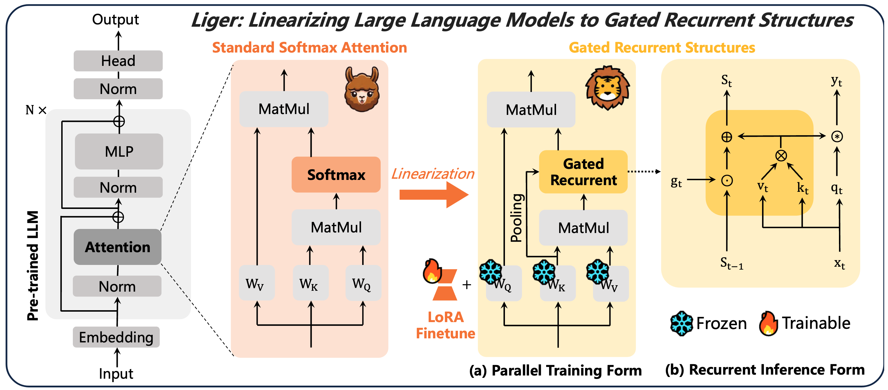

# Liger: Linearizing Large Language Models to Gated Recurrent Structures

[](https://arxiv.org/abs/2503.01496)
 [](https://huggingface.co/collections/linear-moe-hub/liger-67d904bffd7f9b77ade7747d)

## Overview

<p align="center">
  
</p>
<div align="center">
Figure 1: Liger Linearization Framework
</div>

## Environment

```bash
git clone --recurse-submodules https://github.com/OpenSparseLLMs/Linearization.git
conda create -n liger python=3.10
conda activate liger
pip install -r requirements
pip install flash-attn --no-build-isolation
cd third_party/flash-linear-attention
pip install -e .
```

## Linearization

1. Copy your base model weights (e.g. Qwen3-8B) to `./checkpoints/`, and renamed as `liger_qwen3_gla_base`;
2. Modify the `config.json` under `liger_qwen3_gla_base` with new linearized `"architectures"` and `"model_type"`;
3. Modify the linearization settings under `configs` (e.g. liger_qwen3_gla.yaml); 
4. Run the linearization script: `sh scripts/train_liger.sh`

## Evaluation

You need to install [lm-evaluation-harness](https://github.com/EleutherAI/lm-evaluation-harness) for evaluation:

```
cd third_party/lm-evaluation-harness
pip install -e .
```

```bash
python -m eval.harness --model hf \
    --model_args pretrained=/your/Liger/checkpoints/liger_base_model, peft=/your/Liger/checkpoints/lora_adapter_path \
    --tasks piqa,arc_easy,arc_challenge,hellaswag,winogrande \
    --batch_size 64 \
    --device cuda \
    --seed 0
```

## Acknowledgements

We use the triton-implemented linear attention kernels from [fla-org/flash-linear-attention](https://github.com/fla-org/flash-linear-attention). We refer to [HazyResearch/lolcats](https://github.com/HazyResearch/lolcats) to construct our linearization training processs. The evaluation is supported by [lm-evaluation-harness](https://github.com/EleutherAI/lm-evaluation-harness). Sincerely thank their contributions!

## Citation

If you find this repo useful, please cite and star our work:

```bibtex
@article{lan2025liger,
  title={Liger: Linearizing Large Language Models to Gated Recurrent Structures},
  author={Lan, Disen and Sun, Weigao and Hu, Jiaxi and Du, Jusen and Cheng, Yu},
  journal={arXiv preprint arXiv:2503.01496},
  year={2025}
}
```