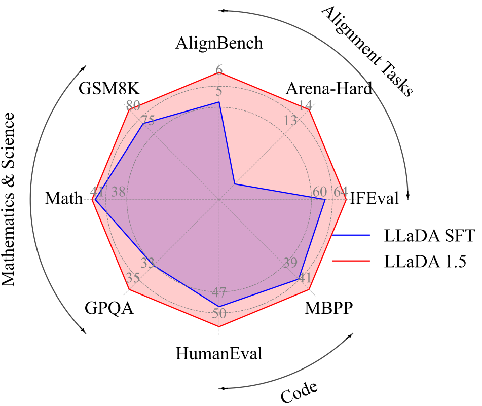

# LLaDA 1.5: Variance-Reduced Preference Optimization for Large Language Diffusion Models

[](https://arxiv.org/abs/2505.19223)
[](https://huggingface.co/GSAI-ML/LLaDA-1.5)

## Introduction

We introduce LLaDA 1.5, a competitive large diffusion language model, trained by variance-reduced preference optimization (VRPO). 

Compared with LLaDA-8B-Instruct, LLaDA 1.5 achieves better performance on a wide range of tasks, including Math, Code, and Alignment tasks.

<div style="display: flex; justify-content: center; align-items: center; width: 100%; margin: 0 auto;">
    
</div>

## Inference

The LLaDA 1.5 model is available on [Huggingface](https://huggingface.co/GSAI-ML/LLaDA-1.5). Please employ the [transformers](https://huggingface.co/docs/transformers/index) to load.

```angular2html
from transformers import AutoModel, AutoTokenizer

tokenizer = AutoTokenizer.from_pretrained('GSAI-ML/LLaDA-1.5', trust_remote_code=True)
model = AutoModel.from_pretrained('GSAI-ML/LLaDA-1.5', trust_remote_code=True, torch_dtype=torch.bfloat16)
```

The model is based on LLaDA-8B-Instruct, you can use the code for [LLaDA-8B-Instruct](https://github.com/ML-GSAI/LLaDA/blob/main/generate.py) to inference.

## Contact

If you have any questions, please feel free to contact fengqizhu@ruc.edu.cn.

## Citation

Please consider cite:

```bibtex
@article{zhu2025llada,
  title={LLaDA 1.5: Variance-Reduced Preference Optimization for Large Language Diffusion Models},
  author={Zhu, Fengqi and Wang, Rongzhen and Nie, Shen and Zhang, Xiaolu and Wu, Chunwei and Hu, Jun and Zhou, Jun and Chen, Jianfei and Lin, Yankai and Wen, Ji-Rong and others},
  journal={arXiv preprint arXiv:2505.19223},
  year={2025}
}
```

## LLaDA Group Wechat QR Code


