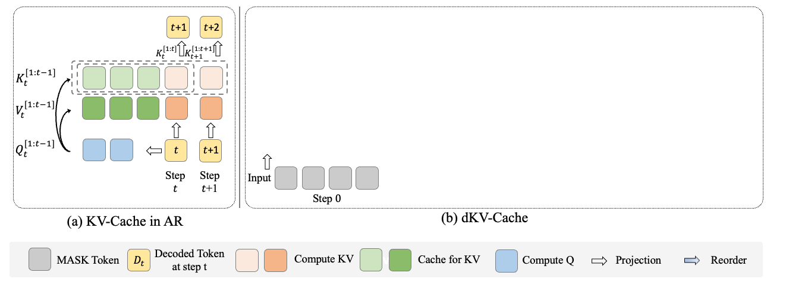
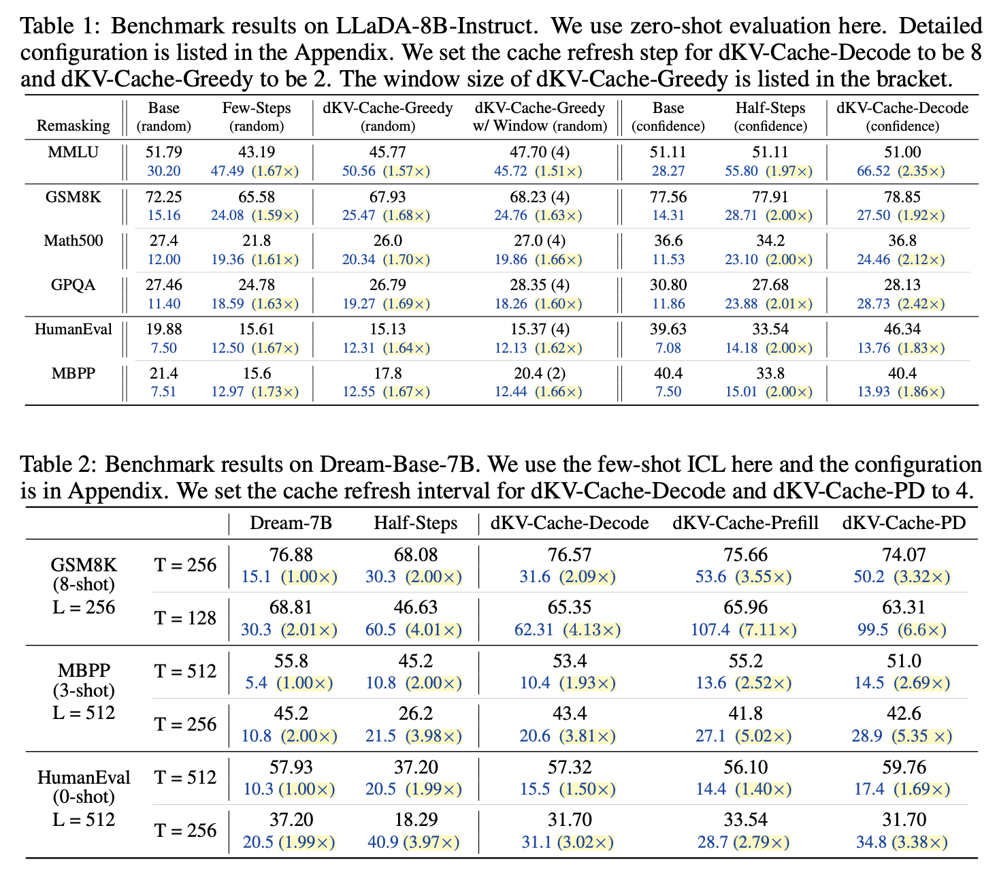

# dKV-Cache: The Cache for Diffusion Language Models
<div align="center">
  </img>
  <br>
  <em>
      The pipeline of dKV-Cache
  </em>
</div>
<br>

> **dKV-Cache: The Cache for Diffusion Language Models**   🥯[[Arxiv]](http://arxiv.org/abs/2505.15781)    
> [Xinyin Ma](https://horseee.github.io/), [Runpeng Yu](https://yu-rp.github.io/), [Gongfan Fang](https://fangggf.github.io/), [Xinchao Wang](https://sites.google.com/site/sitexinchaowang/)   
> [xML Lab](https://sites.google.com/view/xml-nus), National University of Singapore

### Introduction
We introduce dKV-Cache, a specialized KV-Cache for Diffusion Language Models:
* Delayed Caching Mechanism: Unlike autoregressive models, dKV-Cache delays the caching of keys and values.
* Two Variants:
	(1) dKV-Cache-Decode for high-performance inference.
	(2) dKV-Cache-Greedy for potentially faster decoding with some trade-off in performance.
* Speed Acceleration: Applied to LLaDA and Dream, dKV-Cache achieves 2× to 10× speedups over the original implementation, depending on the prefill and decoding lengths.

### Usage
Please install `transformers==4.46.3` first. 

* For generation on Dream:

```python
import torch
- from transformers import AutoModel, AutoTokenizer
+ from models.modeling_dream import DreamModel
+ from transformers import AutoTokenizer

model_path = "Dream-org/Dream-v0-Instruct-7B"
model = DreamModel.from_pretrained(model_path, torch_dtype=torch.bfloat16, trust_remote_code=True)
tokenizer = AutoTokenizer.from_pretrained(model_path, trust_remote_code=True)
model = model.to("cuda").eval()

messages = [
    {"role": "user", "content": "Please write a Python class that implements a PyTorch trainer capable of training a model on a toy dataset."}
]
inputs = tokenizer.apply_chat_template(
    messages, return_tensors="pt", return_dict=True, add_generation_prompt=True
)
input_ids = inputs.input_ids.to(device="cuda")
attention_mask = inputs.attention_mask.to(device="cuda")

output = model.diffusion_generate(
    input_ids,
    attention_mask=attention_mask,
    max_new_tokens=512,
    output_history=True,
    return_dict_in_generate=True,
    steps=512,
    temperature=0.2,
    top_p=0.95,
    alg="entropy",
    alg_temp=0.,
+    use_cache=True,
+    cache_type="decoded",
+    cache_steps=16,
+    shift_type="un"
)
generations = [
    tokenizer.decode(g[len(p) :].tolist())
    for p, g in zip(input_ids, output.sequences)
]

print(generations[0].split(tokenizer.eos_token)[0])

```

Since we observe that inference acceleration is not significant with batch_size=1 (and can sometimes be slower), we provide a script for inference with larger batch sizes:
```
CUDA_VISIBLE_DEVICES=0 python dream_generate.py --decode --cache-steps 4
```

Arguments for `dream_generate.py`:
- `--seq-len`, `--steps`, `--sampling-alg`: The inference configuration for diffusion generation
- `--prefill`: Enable `dkv-cache-prefill`. 
- `--decode`: Enable `dkv-cache-decode`. Need to pass the cache steps in `--cache-steps`.
- `--pd`: Enable `dkv-cache-pd`. Need to pass the cache steps in `--cache-steps`.
- `--cache-steps`: The interval for cache refresh, e.g., 4 is to refresh the cache every 4 steps.

---

* For generation on LLaDA:
```python
import torch
- from transformers import AutoModel, AutoTokenizer
+ from models.modeling_llada_dkv_cache_decode import LLaDAModelLM
+ from generation_utils.llada_dkv_cache_decode import generate
+ from transformers import AutoTokenizer

model = LLaDAModelLM.from_pretrained(
    'GSAI-ML/LLaDA-8B-Instruct', trust_remote_code=True, torch_dtype=torch.bfloat16,
    device_map="auto"
).eval()
tokenizer = AutoTokenizer.from_pretrained('GSAI-ML/LLaDA-8B-Instruct', trust_remote_code=True)

prompt = [
    "Lily can run 12 kilometers per hour for 4 hours. After that, she runs 6 kilometers per hour. How many kilometers can she run in 8 hours?"
] 

m = [[{"role": "user", "content": "Please answer the question step by step and put the answer in \\boxed{}." + p}] for p in prompt]
prompt = tokenizer.apply_chat_template(m, add_generation_prompt=True, tokenize=False)
bsz = len(prompt)

input_ids = tokenizer(
    prompt,
    padding_side = 'left',
    padding = 'longest'
)['input_ids'] 
input_ids = torch.tensor(input_ids).to("cuda")
   

out = generate(
    model, tokenizer, input_ids, 
    steps=128, gen_length=128, block_length=64, 
    temperature=0., cfg_scale=0., 
    remasking='low_confidence',
    enable_cache=True,
    cache_reloading_step=8,
)

res = tokenizer.batch_decode(out[:, input_ids.shape[1]:], skip_special_tokens=True)
print(res[0])
```

We also provide a script for LLaDA generation for different variants of dKV-Cache (only support batch-size = 1 now). The command would be:
```
CUDA_VISIBLE_DEVICES=0 python llada_generate.py --origin
CUDA_VISIBLE_DEVICES=0 python llada_generate.py --decode --cache-steps 8
CUDA_VISIBLE_DEVICES=0 python llada_generate.py --greedy --sampling-alg random --cache-steps 2 --window-size 4
```

### Result
We test our methods on LLaDA-8B-Instruct and Dream-Base-7B on the benchmark. Here are the results for the algorithm.

<div align="center">
  </img>
  <br>
  <em>
      The evaluation results of dKV-Cache
  </em>
</div>
<br>


